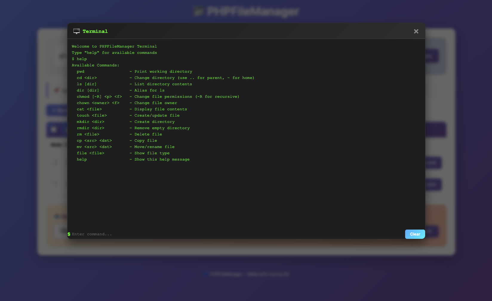

# 📂 PHPFileManager

A modern, web-based file manager built with PHP featuring a beautiful UI, file operations, and permission management.

## 🌟 Description

PHPFileManager is a lightweight, single-file web-based file manager that allows you to browse, upload, rename, and delete files and folders directly from your browser. Built with pure PHP and featuring a modern gradient UI, it provides a simple yet powerful interface for managing your server files with detailed permission and ownership information.

Perfect for developers, system administrators, or anyone who needs quick access to manage files on a PHP-enabled web server.

## ✨ Features

- 📁 **Browse Directories** - Navigate through folders with detailed file information
- 📤 **Upload Files** - Upload files directly through the browser
- ✏️ **Rename Files & Folders** - Easily rename any file or directory
- 🗑️ **Delete Operations** - Delete files and directories (recursive deletion supported)
- 📂 **Create Folders** - Create new directories on the fly
- 🔒 **Permission Details** - View file permissions in both symbolic and numeric formats
- 👤 **Ownership Info** - See file owner and group information
- 🖥️ **Integrated Terminal** - Execute file management commands directly from the web interface
- 🎨 **Modern UI** - Beautiful purple gradient design with responsive layout
- ⚡ **Single File** - Just one PHP file - upload and use immediately
- 🛡️ **Error Diagnostics** - Detailed error messages with permission diagnostics
- 📱 **Mobile Responsive** - Works seamlessly on all devices

## 🖼️ Screenshots


[)
](https://raw.githubusercontent.com/koushikbasu/php-file-manager/refs/heads/main/image-1.png)
*Main interface showing file listing with permissions and actions*

## 📋 Requirements

- PHP 7.0 or higher
- Web server (Apache, Nginx, or any PHP-compatible server)
- POSIX functions enabled (typically available on Linux/Unix servers)

## 🚀 Installation

1. **Download** the `index.php` file
2. **Upload** it to your web server directory
3. **Access** via your browser: `http://yourserver.com/index.php`

That's it! No configuration needed.

## 🔧 Usage

### Browsing Files
- Click on folder names to navigate into directories
- Use the "Back to Parent Folder" button to go up one level
- Current directory path is displayed at the top

### Creating Folders
- Enter a folder name in the "Create New Folder" field
- Click "Create Folder" button

### Uploading Files
- Scroll to the bottom upload section
- Click "Choose File" and select your file
- Click "Upload File" button

### Renaming Files/Folders
- Enter new name in the text field next to the file/folder
- Click the "Rename" button

### Deleting Files/Folders
- Click the "Delete" button next to any file or folder
- Folders will be deleted recursively with all contents

### Using the Integrated Terminal
Click the **"🖥️ Open Terminal"** button to access the command-line interface for advanced file operations:

#### Available Commands

**Navigation & Listing:**
- `pwd` - Print current working directory
- `cd <directory>` - Change directory (use `..` for parent, `~` for home)
- `ls [directory]` - List directory contents with permissions
- `dir [directory]` - Alias for ls

**Permission & Ownership Management:**
- `chmod [-R] <permissions> <file>` - Change file permissions (use `-R` for recursive)
  - Example: `chmod 755 file.txt` or `chmod -R 777 folder`
- `chown <owner> <file>` - Change file owner

**File Operations:**
- `cat <file>` - Display file contents
- `touch <file>` - Create or update file
- `cp <source> <destination>` - Copy file
- `mv <source> <destination>` - Move or rename file
- `rm <file>` - Delete file

**Directory Operations:**
- `mkdir <directory>` - Create new directory
- `rmdir <directory>` - Remove empty directory

**File Information:**
- `file <file>` - Show file type and MIME type

**Help:**
- `help` - Show all available commands

#### Terminal Examples

```bash
# Change to a subdirectory
cd subfolder

# Go back to parent directory
cd ..

# List files in current directory
ls

# Change file permissions to 755
chmod 755 script.sh

# Recursively change permissions for entire directory
chmod -R 777 writable_folder

# Create a new file
touch newfile.txt

# Display file contents
cat file.txt

# Copy a file
cp original.txt backup.txt

# Return to home directory
cd ~
```

## ⚠️ Security Considerations

**IMPORTANT:** This file manager provides direct access to your server's file system. Please consider the following:

1. **Restrict Access** - Place the file in a password-protected directory or add authentication
2. **Use .htaccess** - Limit access by IP address if possible
3. **File Permissions** - Ensure proper file permissions on your server
4. **Delete After Use** - Remove the file manager when not actively needed
5. **HTTPS** - Always use over HTTPS to encrypt data transmission

### Recommended .htaccess Protection

```apache
AuthType Basic
AuthName "Protected Area"
AuthUserFile /path/to/.htpasswd
Require valid-user
```

## 🛠️ Troubleshooting

### Permission Errors - Upload/Delete Fails
When you see permission errors, the file manager now provides detailed diagnostics including:
- Current directory and its permissions
- Script running user and directory owner
- Suggested fix commands

**Quick Fix Using Terminal:**
1. Click **"🖥️ Open Terminal"** button
2. Copy the suggested command (e.g., `chmod -R 777 directory`)
3. Paste and execute in the terminal

**Manual Fix:**
```bash
# Give www-data ownership (recommended)
sudo chown -R www-data:www-data /path/to/directory

# Or set broader permissions (less secure)
sudo chmod -R 777 /path/to/directory

# Or just make readable/writable for group
sudo chmod -R 755 /path/to/directory
```

**Using Terminal Commands:**
```bash
# Quick permission fix via terminal
chmod -R 777 foldername

# Recursive permission change
chmod -R 755 foldername

# Change directory ownership
chown www-data:www-data filename
```

### Cannot Read Directory
Ensure the PHP process has read permissions:
```bash
sudo chmod -R 755 /path/to/directory
```

Or use the integrated terminal:
```bash
chmod -R 755 foldername
```

### Upload Fails
**Check File Manager Diagnostics:**
- The error message will show directory owner, current user, and permissions
- Check filename for invalid characters
- Verify available disk space

**Check PHP upload settings in `php.ini`:**
```ini
upload_max_filesize = 50M
post_max_size = 50M
```

**Using Terminal to Debug:**
```bash
# Check current directory
pwd

# List files with permissions
ls

# Check file size limits
touch testfile.txt
cat testfile.txt
rm testfile.txt
```

### File Manager Not Writable
Use the terminal to fix:
```bash
# Navigate to directory
cd foldername

# Change to full permissions
chmod -R 777 .

# Or make it group writable
chmod -R 775 .
```

## 🎯 Best Practices

1. **Use the Terminal** for bulk operations like `chmod -R 777 directoryname`
2. **Check Permissions** regularly with `ls` to understand your file structure
3. **Backup Important Files** before performing deletion operations
4. **Monitor Disk Usage** when uploading large files
5. **Keep the Manager Secure** - limit access with passwords/IP restrictions

## 🤝 Contributing

Contributions are welcome! Please feel free to submit a Pull Request.

1. Fork the repository
2. Create your feature branch (`git checkout -b feature/AmazingFeature`)
3. Commit your changes (`git commit -m 'Add some AmazingFeature'`)
4. Push to the branch (`git push origin feature/AmazingFeature`)
5. Open a Pull Request

## 📝 License

This project is licensed under the MIT License - see the [LICENSE](LICENSE) file for details.

## 👨‍💻 Author

[**Koushik Basu** - Made with 💙](https://github.com/koushikbasu/)

## 🙏 Acknowledgments

- Built with pure PHP - no external dependencies
- Modern CSS3 gradients and animations
- Responsive design for all devices

## 📞 Support

If you encounter any issues or have questions, please open an issue on GitHub.

## 📊 Technical Details

- **Language**: PHP 7.0+
- **Frontend**: HTML5, CSS3, JavaScript (Vanilla)
- **Lines of Code**: ~1200
- **Dependencies**: None
- **Size**: ~35KB
- **License**: MIT

## 📝 Changelog

### Version 2.0 - Terminal Edition
- ✅ Added integrated web terminal with command support
- ✅ Implemented `cd` command for directory navigation
- ✅ Added `chmod -R` for recursive permission changes
- ✅ Implemented file operations: `cat`, `touch`, `cp`, `mv`, `rm`
- ✅ Added directory operations: `mkdir`, `rmdir`
- ✅ File type detection with `file` command
- ✅ Enhanced error diagnostics with detailed permission info
- ✅ Improved UI with beautified form styling
- ✅ Responsive design improvements
- ✅ Better error messages with suggested solutions

### Version 1.0 - Initial Release
- File browsing and navigation
- Upload, rename, delete operations
- Permission and ownership display
- Beautiful gradient UI
- Responsive mobile design

---

⭐ **Star this repository if you find it helpful!**

💡 **Tip**: Bookmark this file manager URL for quick access to your server files!

## 🎨 UI Improvements

- **Toolbar**: Enhanced folder creation form with better styling and spacing
- **Upload Section**: File input and button aligned horizontally for compact layout
- **Terminal Modal**: Dark theme terminal interface with responsive design
- **Error Messages**: Color-coded and detailed error diagnostics
- **Button Styling**: Improved button sizing and hover effects
- **Mobile Responsive**: Optimized for tablets and smartphones
